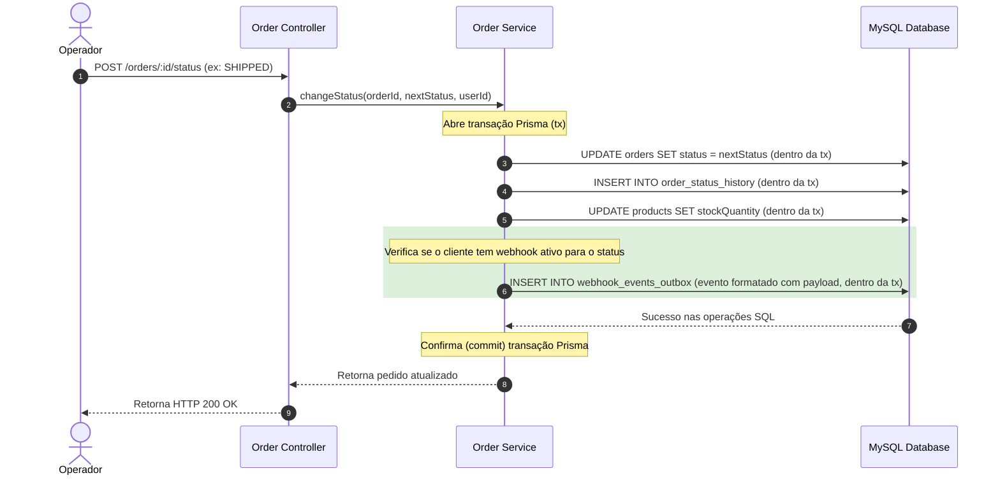
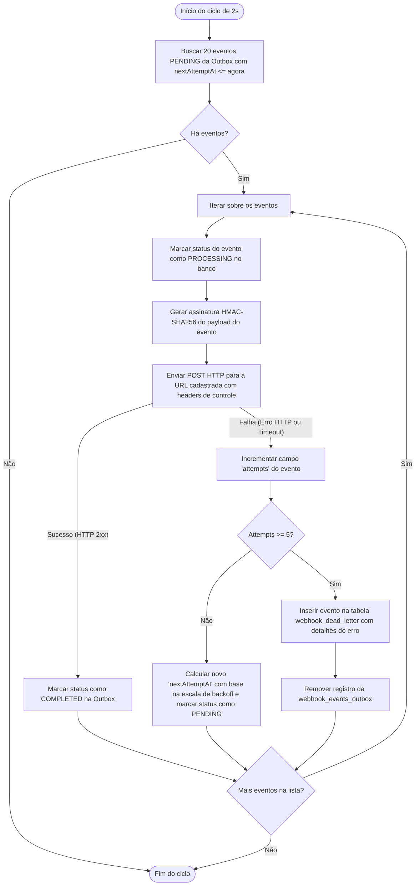

# FDD — Feature Design Document

## 1. Contexto e Motivação Técnica
Esta especificação técnica detalha a implementação do módulo de webhooks do Order Management System (OMS) para disparo de eventos assíncronos de status de pedidos. O objetivo é fornecer uma implementação limpa baseada no padrão *Transactional Outbox*, garantindo robustez na entrega, isolamento da thread da API REST e segurança na comunicação com terceiros.

---

## 2. Objetivos Técnicos
* **Consistência Atômica:** Garantir que o evento de webhook e a alteração do pedido no banco de dados sejam salvos em uma única transação atômica.
* **Isolamento de Processo:** Implementar o worker como um processo executado de forma paralela (`npm run worker`), desacoplado do servidor principal Express.
* **Integridade Operacional:** Assegurar que assinaturas digitais sejam calculadas de forma segura e que as tentativas de reenvio respeitem progressões de tempo estritas.

---

## 3. Escopo e Exclusões
* **Incluso:** Criação de rotas HTTP de CRUD de webhooks, lógica de polling a cada 2 segundos no worker, processador de envio via `axios`, controle de DLQ e reenvio manual para administradores.
* **Exclusões:** Não há componentes ou telas de frontend envolvidos nesta especificação técnica. Nenhuma lógica de mensageria externa (como RabbitMQ ou Kafka) será construída.

---

## 4. Fluxos Detalhados

### 4.1. Fluxo de Mudança de Status de Pedido e Registro na Outbox (API)
Quando um operador altera o status de um pedido, o fluxo de transação executa as operações abaixo no banco MySQL:



### 4.2. Fluxo do Ciclo do Worker de Disparo de Webhook (Processo Worker)
O worker roda em loop a cada 2 segundos, executando as etapas:



---

## 5. Contratos Públicos (API endpoints)

### 5.1. Criar Configuração de Webhook
* **Rota:** `POST /webhooks`
* **Autenticação:** JWT obrigatório (Role `ADMIN` ou `OPERATOR`).
* **Request Payload (Exemplo):**
```json
{
  "customerId": "d3b07384-d113-4fd4-a6f3-6058097b6a4a",
  "url": "https://api.atlascomercial.com/webhooks/orders",
  "events": ["SHIPPED", "DELIVERED"]
}
```
* **Response (Exemplo - HTTP 201 Created):**
```json
{
  "id": "e9c7e0c4-954d-44aa-ba6c-c69e2c974cd0",
  "customerId": "d3b07384-d113-4fd4-a6f3-6058097b6a4a",
  "url": "https://api.atlascomercial.com/webhooks/orders",
  "events": ["SHIPPED", "DELIVERED"],
  "secret": "whsec_2a02b118b628ec2c943ad637eb87b649d21c7a8b417e",
  "active": true,
  "createdAt": "2026-06-26T18:00:00.000Z"
}
```

### 5.2. Listar Histórico de Entregas
* **Rota:** `GET /webhooks/:id/deliveries`
* **Autenticação:** JWT obrigatório.
* **Response (Exemplo - HTTP 200 OK):**
```json
[
  {
    "id": "9a7522f1-67ba-4a36-b6ef-59df95b3531b",
    "webhookId": "e9c7e0c4-954d-44aa-ba6c-c69e2c974cd0",
    "eventId": "18f98a21-998a-4d75-a81d-e59ba3d7890f",
    "attemptNumber": 1,
    "httpStatus": 200,
    "responseTimeMs": 145,
    "deliveredAt": "2026-06-26T18:02:05.123Z",
    "success": true
  },
  {
    "id": "8b6422fa-67ba-4a36-b6ef-59df95b3531b",
    "webhookId": "e9c7e0c4-954d-44aa-ba6c-c69e2c974cd0",
    "eventId": "28f98a21-998a-4d75-a81d-e59ba3d7890f",
    "attemptNumber": 1,
    "httpStatus": 500,
    "responseTimeMs": 10000,
    "deliveredAt": "2026-06-26T18:01:00.000Z",
    "success": false
  }
]
```

### 5.3. Rotacionar Segredo do Webhook
* **Rota:** `POST /webhooks/:id/rotate-secret`
* **Autenticação:** JWT obrigatório.
* **Response (Exemplo - HTTP 200 OK):**
```json
{
  "message": "Segredo rotacionado com sucesso. O segredo antigo permanecerá válido em paralelo pelo grace period de 24 horas.",
  "newSecret": "whsec_9c18f102a392ec2c493ad637eb87b649d21c7a8b417e",
  "expiresAt": "2026-06-27T18:00:00.000Z"
}
```

### 5.4. Replay Manual de Evento da DLQ
* **Rota:** `POST /admin/webhooks/dead-letter/:id/replay`
* **Autenticação:** JWT obrigatório (Restrito a `ADMIN`).
* **Response (Exemplo - HTTP 200 OK):**
```json
{
  "message": "Evento de DLQ recolocado com sucesso na fila outbox.",
  "eventId": "18f98a21-998a-4d75-a81d-e59ba3d7890f",
  "requeuedAt": "2026-06-26T18:25:30.456Z"
}
```

---

## 6. Matriz de Erros Previstos (Padrão WEBHOOK_*)

| Código de Erro | Status HTTP | Mensagem Descritiva | Causa |
|---|---|---|---|
| `WEBHOOK_NOT_FOUND` | 404 | Configuração de webhook especificada não foi localizada. | O ID do webhook passado no path não existe no banco de dados. |
| `WEBHOOK_INVALID_URL` | 400 | A URL de destino informada deve utilizar obrigatoriamente o protocolo seguro HTTPS. | O cliente tentou registrar um webhook usando `http://`. |
| `WEBHOOK_LIMIT_EXCEEDED` | 400 | Limite máximo de webhooks por cliente foi excedido. | O cliente já possui o limite de webhooks cadastrados (ex.: 5 por cliente). |
| `WEBHOOK_SECRET_REQUIRED` | 400 | O segredo do webhook é obrigatório para rotação. | A rotação foi solicitada para um endpoint que não possui secret ativa. |
| `WEBHOOK_SIZE_EXCEEDED` | 400 | O payload do evento excede o limite máximo permitido de 64 KB. | O payload gerado ultrapassou 64 KB de tamanho serializado. |

---

## 7. Estratégias de Resiliência
* **Timeout de Requisição:** As chamadas HTTP de envio disparadas pelo worker terão um timeout agressivo de **10 segundos** para liberar conexões rapidamente em caso de falhas ou lentidão severa.
* **Escala de Retentativas (Retry Backoff):** A cada falha, calcula-se o próximo envio com os intervalos progressivos: **1m, 5m, 30m, 2h, 12h**.
* **Tratamento de Indisponibilidade Definitiva:** Após a 5ª tentativa mal-sucedida, o evento é expurgado da tabela ativa de processamento e persistido em `webhook_dead_letter` (DLQ) com o status do erro correspondente para auditoria e intervenção humana.

---

## 8. Observabilidade
* **Logs Operacionais (Pino):** O worker registra logs estruturados no padrão JSON em todas as etapas críticas:
  * `info` ao localizar novos eventos de outbox pendentes.
  * `warn` em cada tentativa falha, reportando status HTTP e ID da tentativa.
  * `error` ao despachar um evento para a DLQ.
  * `info` para auditoria administrativa de reenvio com o ID do administrador.
* **Métricas de Performance:** Cálculo e gravação de `responseTimeMs` (tempo de resposta do servidor do cliente) em cada tentativa no histórico de entregas.

---

## 9. Dependências e Compatibilidade
* **Bibliotecas:** `axios` para o cliente HTTP do worker; `crypto` (módulo nativo do Node.js) para geração de segredos e cálculo do HMAC-SHA256.
* **Compatibilidade:** O esquema de banco do Prisma utiliza as definições existentes compatíveis com MySQL.

---

## 10. Critérios de Aceite Técnicos
1. Validação Zod bloqueando qualquer URL sem prefixo `https://`.
2. O worker de disparo deve rodar com o comando `npm run worker` em processo e console distintos da API pública.
3. Requisições recebidas pelo mock server de testes devem conter o cabeçalho `X-Signature` cujo hash de validação corresponda ao corpo JSON recebido decodificado com o segredo correto do webhook cadastrado.

---

## 11. Riscos e Mitigação
* **Bloqueio do Event Loop do Worker:** Clientes com conexões travadas podem esgotar recursos de sockets.
  * *Mitigação:* Configuração obrigatória de timeout de 10s no Axios e uso de conexões reutilizáveis (Keep-Alive).

---

## 12. Integração com o Sistema Existente
Esta funcionalidade se integra à codebase existente nos seguintes pontos críticos:

1. **[src/modules/orders/order.service.ts](file:///c:/Users/Felipe%20Fonseca/Documents/01.%20primeiro_projeto/Projetos%20Full%20Cycle/Atividade%205/src/modules/orders/order.service.ts):**
   * O método `changeStatus` de pedidos será estendido. O processamento transacional (que utiliza `$transaction` do Prisma) receberá uma chamada final para uma função auxiliar de enfileiramento: `publishWebhookEvent(tx, order, fromStatus, toStatus)`. O parâmetro `tx` do PrismaClient será compartilhado para garantir que a inserção na tabela `webhook_events_outbox` ocorra na mesma transação atômica que atualiza o status do pedido.
2. **[src/shared/errors/app-error.ts](file:///c:/Users/Felipe%20Fonseca/Documents/01.%20primeiro_projeto/Projetos%20Full%20Cycle/Atividade%205/src/shared/errors/app-error.ts):**
   * Toda exceção do webhook (como `WEBHOOK_NOT_FOUND` ou `WEBHOOK_INVALID_URL`) estenderá a classe `AppError` passando a mensagem de erro descritiva e o código de erro no padrão de formato da aplicação.
3. **[src/middlewares/auth.middleware.ts](file:///c:/Users/Felipe%20Fonseca/Documents/01.%20primeiro_projeto/Projetos%20Full%20Cycle/Atividade%205/src/middlewares/auth.middleware.ts):**
   * O endpoint `POST /admin/webhooks/dead-letter/:id/replay` utilizará o middleware de autorização baseado em perfis `requireRole(UserRole.ADMIN)` para barrar acessos não autorizados por operadores comuns.
4. **[src/middlewares/error.middleware.ts](file:///c:/Users/Felipe%20Fonseca/Documents/01.%20primeiro_projeto/Projetos%20Full%20Cycle/Atividade%205/src/middlewares/error.middleware.ts):**
   * O middleware de erros global capturará as exceções `AppError` geradas pelo novo módulo e responderá com o status HTTP correto e o payload no formato padronizado da API.
5. **[src/shared/logger/index.ts](file:///c:/Users/Felipe%20Fonseca/Documents/01.%20primeiro_projeto/Projetos%20Full%20Cycle/Atividade%205/src/shared/logger/index.ts):**
   * Toda a instrumentação de logs estruturados do worker de disparo e do serviço será canalizada diretamente pela mesma instância global do logger Pino.
